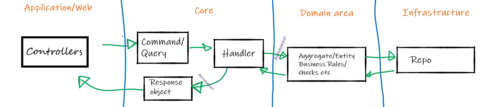

# Микросервисы для ресторана
<!-- omit from toc -->
#### Студент: Нечесов Андрей Львович
#### БПИ217

## Разработанные микросервисы
В рамках домашнего задания согласно [ТЗ](ДЗ4-КПО-2023-may-02-1.pdf) было разработано два микросервиса, каждый из которых располагается в собственном git-резпозитории:  
**Микросервис авторизации**: https://github.com/Bopobywek/RestaurantHomework.Authorization  
**Микросервис обработки заказов**: https://github.com/Bopobywek/RestaurantHomework.OrdersServer

## Запуск микросервисов
Для запуска каждого микросервиса нужно выполнить
```console
sudo docker-compose up -d
```
в директории каждого из сервисов.

## Описание архитектуры
Выделено три слоя:
1. Слой данных (DAL)
2. Слой Бизнес-Логики (BLL)
3. API

Используется паттерн MediatR


## Swagger
При запуске каждого из микросервисов открывается сваггер, в котором приведены все доступные схемы и запросы. В сваггере для микросервиса обработки заказов можно авторизоваться. Для этого нужно нажать на специальную кнопку "Authorize" и ввести полученнный от микросервиса авторизации токен в формате "Bearer &lt;token&gt;"

При запуске через docker-compose сваггер автоматически не откроется. Чтобы перейти к сваггеру сервиса авторизации, нужно обратиться к `localhost:8080/swagger`, `localhost:8081/swagger` &mdash; для сервиса обработки заказов.
